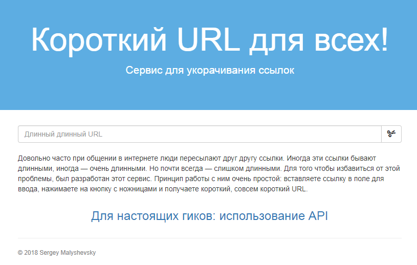

# Click

Click is a service for converting long URL to short. For example, you have reference http://www.example.com?text=long-long-long-long-long-long-url.
Copy it URL to input field and click button. System generates short URL like http://127.0.0.1:8000/abc. Now you can send this reference to other people.
And when they put this string to browser address bar, service redirects them to the original site.
Moreover, service generates QR code and you can just save it and send to your friend.

## Getting Started

These instructions will get you a copy of the project up and running on your local machine for development and testing purposes.

### Prerequisites

Python 3.x must be installed on your computer. If you haven't it, you can download Python 3 from [official site](https://www.python.org/downloads/)

### Installing

Create new directory and clone project using Git

```
git clone https://github.com/SergeyMalyshevsky/Click.git
```

Install necessary libraries using PIP

```
pip install -r requirements.txt
```

Add tables to database

```
python manage.py migrate
```

Run local web server

```
python manage.py runserver
```

Open your browser and open address http://127.0.0.1:8000/



## Running the tests

For checking work of functions run tests

```
python manage.py test
```

## Built With

* [Django](https://docs.djangoproject.com/en/2.1/) - The web framework used
* [Pip](https://pip.pypa.io/en/stable/user_guide/) - Package Management
* [QR Code](http://omz-software.com/editorial/docs/ios/qrcode.html) - Used to generate QR Code

## Author

* **Sergey Malyshevsky** - [Click](https://github.com/SergeyMalyshevsky)

See also the list of [contributors](https://github.com/Click/contributors) who participated in this project.

## License

This project is licensed under the MIT License - see the [LICENSE.md](LICENSE.md) file for details

